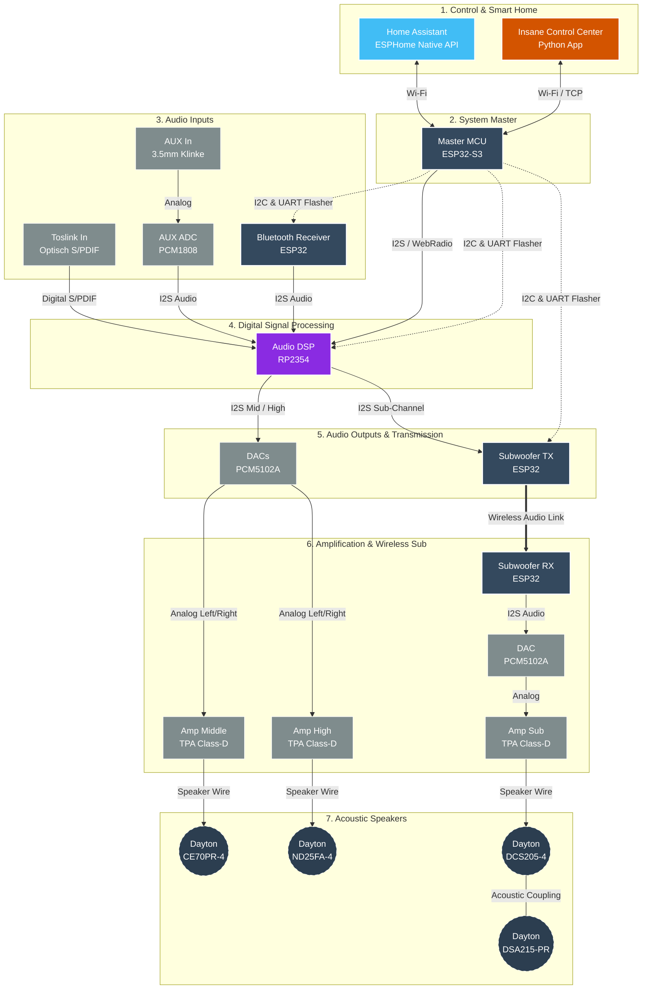
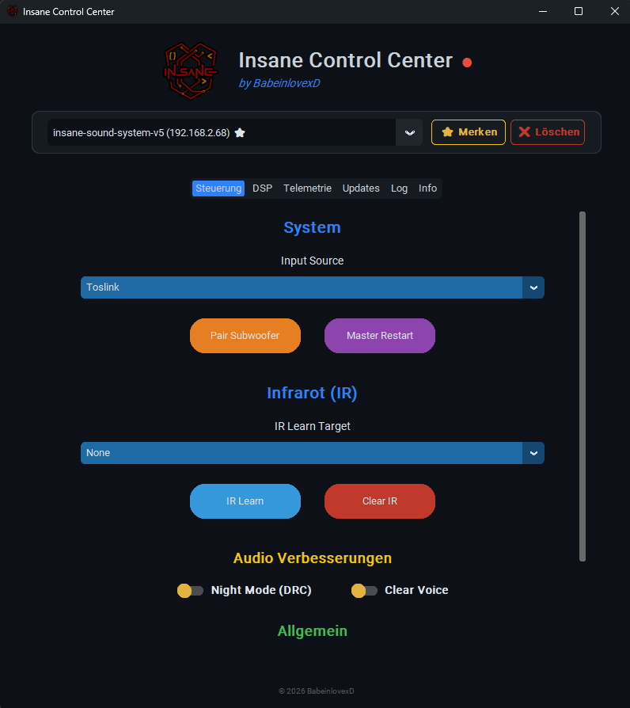
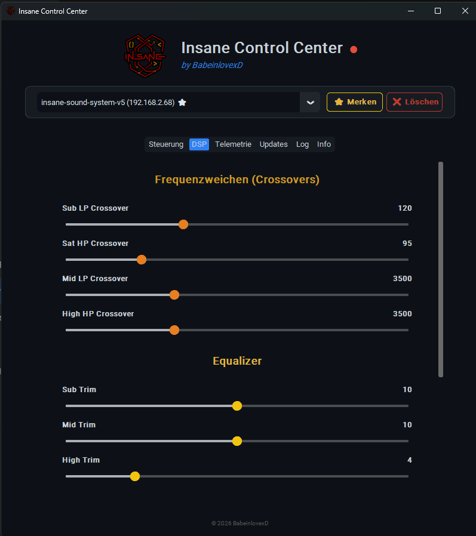
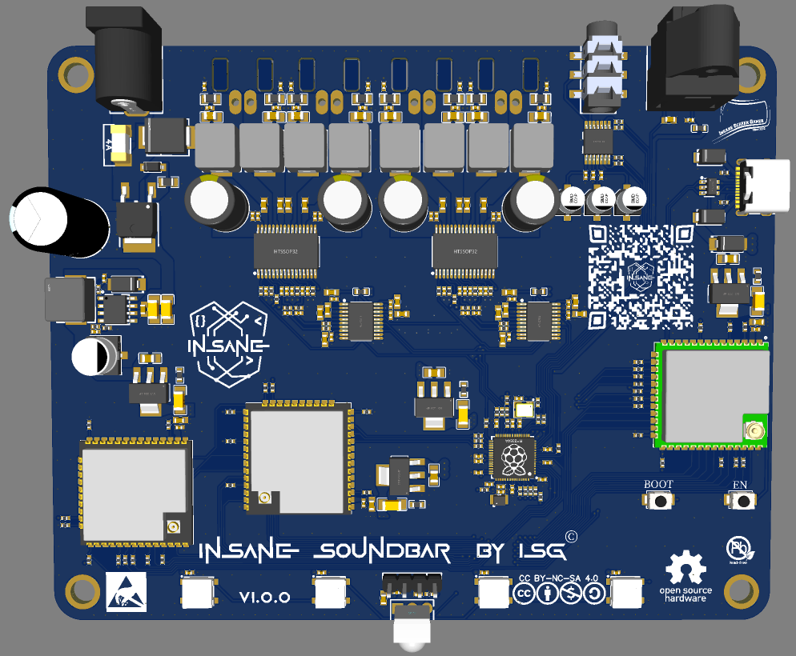
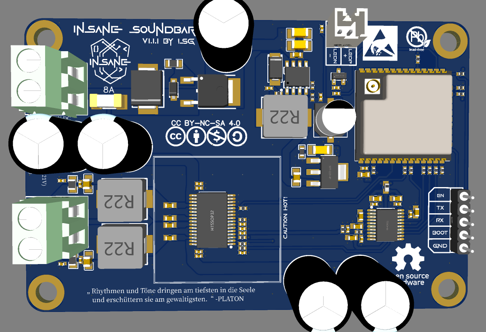
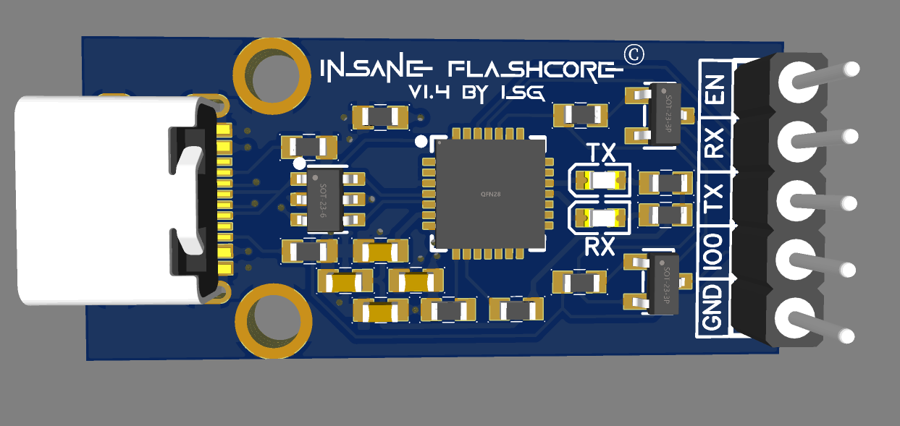

# 🔊 Insane Soundbar

Four ESP32-Cores and an RP2354A-Hardware-DPS for lossless audio and full smart home intergation.

---

---

---

 

---

 

---

---

 

 

---

---

    

---

## ☕ Support this project
**Insane Soundbar** took a ton of time, endless caffeine, and a few of my sanity cells. If you love the system and want to support my work, I'd appreciate a virtual coffee.

Every cent goes directly toward the ongoing development of ISB and new prototypes. 🚀

---

## 👨‍💻 Entwickelt von

| [ **BabeinlovexD**](https://github.com/babeinlovexd) |
| :---: |

---

